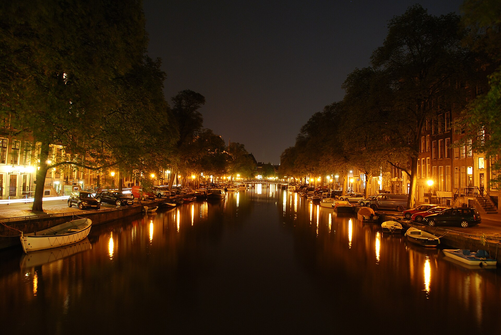
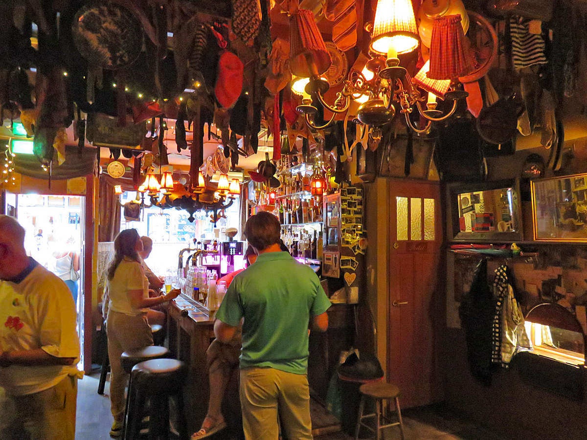
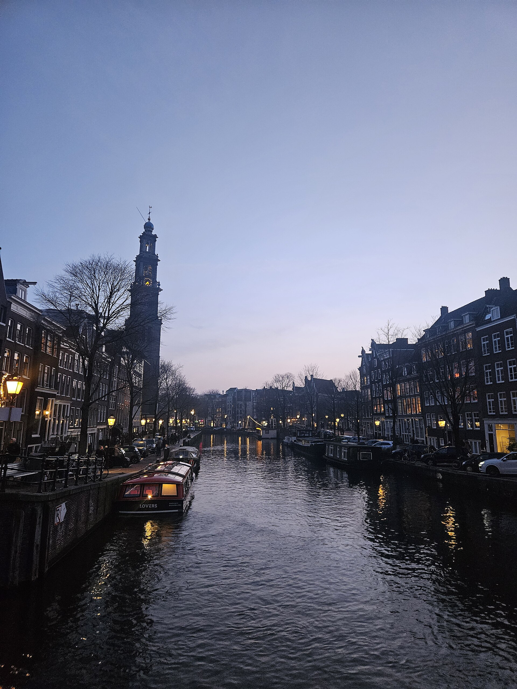

  
  

    
Ein Brüderwochenende

    
Amsterdam

    
9.–11. Oktober 2026

  

Grachten · Bars · Coffeeshops · Boot

## Freitag, 9. Oktober

Ankommen und los

| Zeit | Programm | Info | Buchen |
|---|---|---|---|
| 18.00 | Flughafen Zürich | Abflug 19.25 · KL1926 | |
| 21.00 | Ankunft Schiphol | Bus 397 → [Anreise](#anreise) | |
| 22.00 | [Hotel Van Gogh](https://www.google.com/maps/search/?api=1&query=Hotel+Van+Gogh%2C+Van+de+Veldestraat+5%2C+Amsterdam) | Van de Veldestraat 5 · Check-in bis 23.30 | |
| 22.30 | [Café Eijlders](https://www.google.com/maps/search/?api=1&query=Caf%C3%A9+Eijlders%2C+Korte+Leidsedwarsstraat+47%2C+Amsterdam) | Braune Kneipe (bruin café: holzgetäfeltes Stammlokal) · Korte Leidsedwarsstraat 47 · 10 Min. zu Fuss · bis 2.00 | |
| 23.45 | [Flying Dutchmen Cocktails](https://www.google.com/maps/search/?api=1&query=Flying+Dutchmen+Cocktails%2C+Singel+460%2C+Amsterdam) | Cocktailbar im Grachtenhaus von 1662 · Singel 460 · bis 4.00 | ohne |
| 1.30 | [Café De Duivel](https://www.google.com/maps/search/?api=1&query=Caf%C3%A9+De+Duivel%2C+Reguliersdwarsstraat+87%2C+Amsterdam) | Hip-Hop-Bar · Reguliersdwarsstraat 87 · bis 4.00 | |
| danach | [FEBO](https://www.google.com/maps/search/?api=1&query=FEBO%2C+Leidsestraat+94%2C+Amsterdam) | Snackautomat: Kroketten, frikandel (Wurst) · Leidsestraat 94 · bis 4.00 | |

## Samstag, 10. Oktober

Coffeeshops, Boot und Nacht

| Zeit | Programm | Info | Buchen |
|---|---|---|---|
| 9.45 | [Bakers & Roasters](https://www.google.com/maps/search/?api=1&query=Bakers+%26+Roasters%2C+Eerste+Jacob+van+Campenstraat+54%2C+Amsterdam) | Brunch · De Pijp · 15 Min. zu Fuss · Warteliste vor Ort | |
| 11.15 | [Albert Cuypmarkt](https://www.google.com/maps/search/?api=1&query=Albert+Cuypmarkt%2C+Albert+Cuypstraat%2C+Amsterdam) | Strassenmarkt · Stroopwafel, Hering, kibbeling (frittierter Fisch) | |
| 12.30 | [Boerejongens Centrum](https://www.google.com/maps/search/?api=1&query=Boerejongens+Centrum%2C+Utrechtsestraat+21%2C+Amsterdam) | Coffeeshop · Utrechtsestraat 21 · 20 Min. zu Fuss | |
| 13.30 | [Tweede Kamer](https://www.google.com/maps/search/?api=1&query=Tweede+Kamer%2C+Heisteeg+6%2C+Amsterdam) | Coffeeshop · Heisteeg 6, beim Spui | |
| 14.15 | [Grey Area](https://www.google.com/maps/search/?api=1&query=Grey+Area%2C+Oude+Leliestraat+2%2C+Amsterdam) | Coffeeshop · Oude Leliestraat 2 | |
| 15.00 | [Private Smoke Boat](https://www.google.com/maps/search/?api=1&query=Private+Smoke+Boat%2C+Oosterdokskade+8%2C+Amsterdam) | Privatboot mit Skipper · 2 Std. · Oosterdokskade 8 · 20 Min. zu Fuss | **[Buchen](https://smoke-friendly-boat.amsterdam/book/)** |
| 17.15 | Hotel | Tram 2 oder 12 ab Centraal → Van Baerlestraat | |
| 19.30 | [Café Loetje](https://www.google.com/maps/search/?api=1&query=Caf%C3%A9+Loetje%2C+Johannes+Vermeerstraat+52%2C+Amsterdam) | Abendessen · Steak mit Pommes · 5 Min. zu Fuss | **[Reservieren](https://www.loetje.nl/en/locations/)** |
| 21.30 | [Door 74](https://www.google.com/maps/search/?api=1&query=Door+74%2C+Reguliersdwarsstraat+74%2C+Amsterdam) | Speakeasy · schwarze Tür links vom Restaurant Shiva, klingeln · Tram 2 oder 12 | **[Reservieren](https://www.finddoor74.com/)** |
| 23.30 | [Café De Duivel](https://www.google.com/maps/search/?api=1&query=Caf%C3%A9+De+Duivel%2C+Reguliersdwarsstraat+87%2C+Amsterdam) | Hip-Hop-Bar · 2 Min. zu Fuss | |
| 1.00 | [Shelter](https://www.google.com/maps/search/?api=1&query=Shelter%2C+Overhoeksplein+3%2C+Amsterdam) | Club im Keller des A'DAM Toren · Entasia b2b Freddi u. a. · 23.00–6.00 · Gratisfähre hinter Centraal oder Uber | **[Tickets](https://web.fourvenues.com/en/shelter-amsterdam)** |

## Sonntag, 11. Oktober

Frühstück und Heimreise

| Zeit | Programm | Info | Buchen |
|---|---|---|---|
| 9.30 | [Brasserie De Joffers](https://www.google.com/maps/search/?api=1&query=Brasserie+De+Joffers%2C+Willemsparkweg+163%2C+Amsterdam) | Frühstück · Willemsparkweg 163 · 8 Min. zu Fuss | **[Reservieren](https://brasseriedejoffers.nl/en/reservations/)** |
| 11.00 | Check-out | Gepäck an der Rezeption lassen | |
| 12.15 | Bus 397 ab Museumplein | → [Anreise](#anreise) | |
| 12.50 | Schiphol | | |
| 14.40 | Abflug | via Paris · Ankunft Zürich 18.35 | |

## Anreise

**Freitag · Schiphol → Hotel** · [Route](https://www.google.com/maps/dir/?api=1&origin=Schiphol+Plaza&destination=Van+de+Veldestraat+5%2C+Amsterdam&travelmode=transit)

| Ab | Verbindung | Info |
|---|---|---|
| ca. 21.20 | Bus 397 → Museumplein | Schiphol Plaza, Steig B17 · ca. 30 Min. · alle 8–15 Min. |
| ca. 21.50 | zu Fuss → Hotel | 5 Min. |

**Sonntag · Hotel → Schiphol** · [Route](https://www.google.com/maps/dir/?api=1&origin=Van+de+Veldestraat+5%2C+Amsterdam&destination=Schiphol+Plaza&travelmode=transit)

| Ab | Verbindung | Info |
|---|---|---|
| 12.15 | Bus 397 ab Museumplein | ca. 30 Min. |
| Reserve | Tram 5 → Amsterdam Zuid, Zug → Schiphol | ca. 35 Min. |

| Tickets | |
|---|---|
| Bus, Tram, Zug | Kontaktlose Bankkarte oder Handy beim Ein- und Aussteigen an den Leser halten · eine Karte pro Person |

## Gut zu wissen

| Thema | |
|---|---|
| Coffeeshops | ab 18, Ausweis mitnehmen · max. 5 g pro Einkauf · kein Alkohol · drinnen kein Tabak |
| Bezahlen | manche nur bar, manche nur Karte · beides mitnehmen |
| Boot | Rauchen nur an Deck, nicht in der Kabine · Gras vorher im Coffeeshop kaufen |
| Strasse | Kiffen verboten im Rotlichtviertel, am Dam, Damrak und Nieuwmarkt |
| Door 74 | nur mit Reservierung |

## Hotel

| Hotel | [Hotel Van Gogh](https://www.google.com/maps/search/?api=1&query=Hotel+Van+Gogh%2C+Van+de+Veldestraat+5%2C+Amsterdam) |
|---|---|
| Adresse | Van de Veldestraat 5, 1071 CW Amsterdam |
| Check-in | Freitag, bis 23.30 |
| Check-out | Sonntag, bis 11.00 |

## Wetter

| Wetter | Oktober |
|---|---|
| Temperatur | ca. 7–14 °C, windig, oft Schauer |
| Dunkel ab | ca. 19.00 |

Bilder: Wikimedia Commons · Gracht © MarcusObal, CC BY-SA 3.0 · Prinsengracht © Cristalmoon 27, CC BY-SA 4.0 · Café 't Mandje © Paul2, CC BY-SA 4.0
