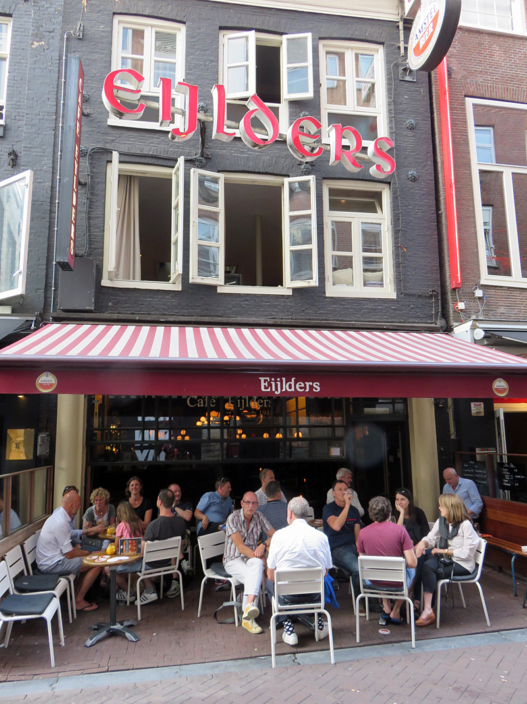
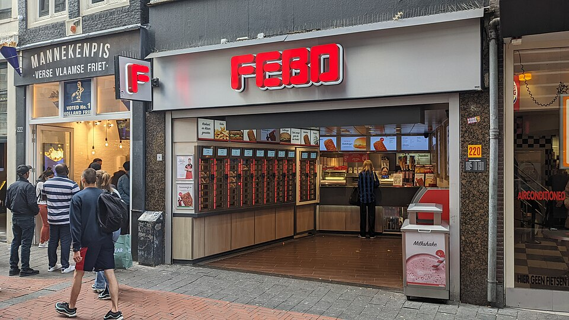
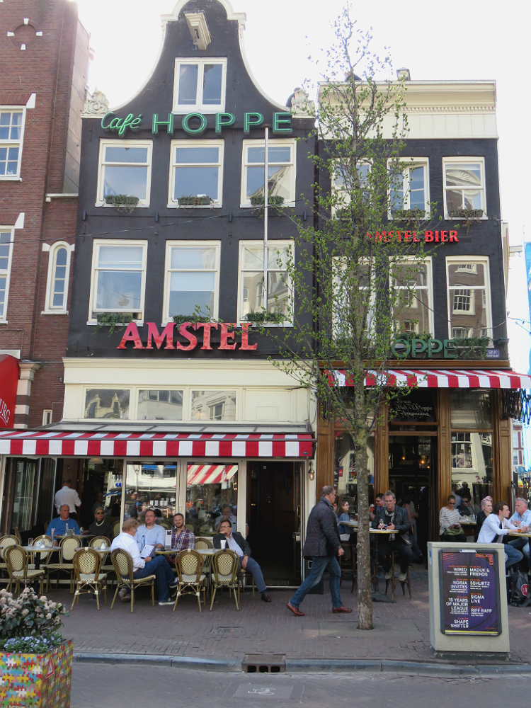
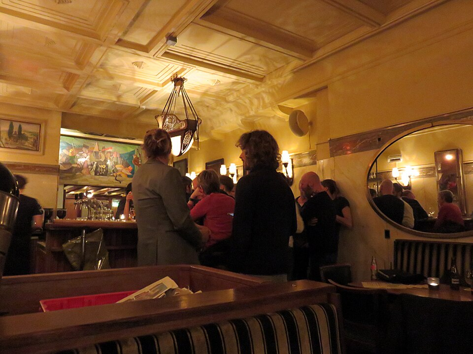
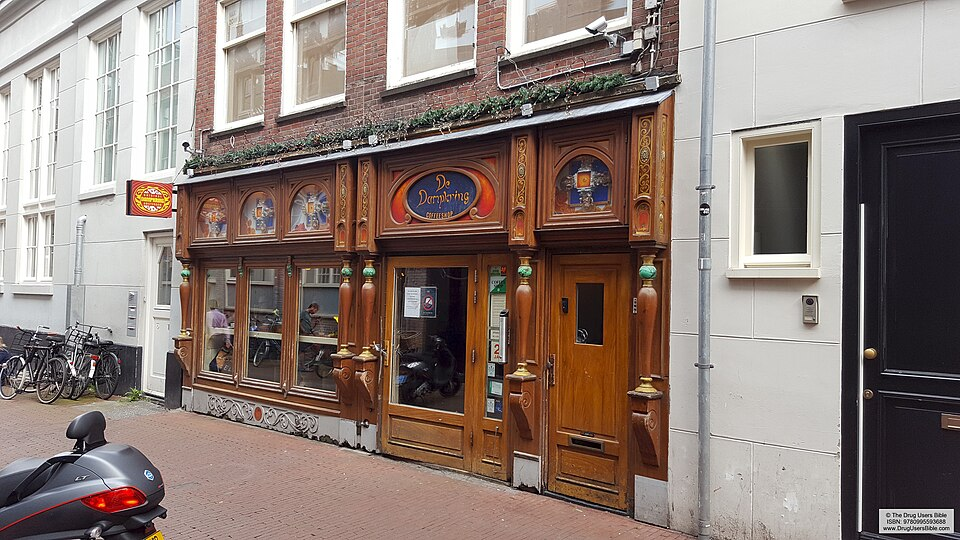

  
  

    
Ein Brüderwochenende

    
Amsterdam

    
9.–11. Oktober 2026

  

Grachten · Kneipen · Coffeeshops

## Freitag, 9. Oktober

Ankommen, essen, Coffeeshop, Kneipe

| Zeit | Programm | Info | Buchen |
|---|---|---|---|
| 12.45 | [Flughafen Zürich](https://www.google.com/maps/search/?api=1&query=Flughafen+Z%C3%BCrich) | Abflug 14.20 · KL1922 | |
| 15.55 | [Ankunft Schiphol](https://www.google.com/maps/search/?api=1&query=Schiphol+Plaza%2C+Amsterdam) | Bus 397 → [Anreise](#anreise) | |
| 17.00 | [Hotel Van Gogh](https://www.google.com/maps/search/?api=1&query=Hotel+Van+Gogh%2C+Van+de+Veldestraat+5%2C+Amsterdam) | Museumplein · Check-in bis 23.30 | |
| 17.45 | [Café de Klos](https://www.google.com/maps/search/?api=1&query=Caf%C3%A9+de+Klos%2C+Kerkstraat+41%2C+Amsterdam) | Spareribs vom Grill · 15 Min. zu Fuss · Fr ab 14.00, bis 23.00 · keine Reservierung, Wartebar gegenüber · falls voll: [Piet de Leeuw](https://www.google.com/maps/search/?api=1&query=Piet+de+Leeuw%2C+Noorderstraat+11%2C+Amsterdam) (Steakhaus seit 1949, 8 Min.) | **[Plan B reservieren](https://www.pietdeleeuw.nl/)** |
| 19.15 | [Kadinsky](https://www.google.com/maps/search/?api=1&query=Coffeeshop+Kadinsky%2C+Rosmarijnsteeg+9%2C+Amsterdam) | Coffeeshop · am Rand der Negen Straatjes (neun kleine Läden-Gassen zwischen den Grachten) · 12 Min. zu Fuss · hell, viel Platz · bis 1.00 · falls voll: [Dampkring](https://www.google.com/maps/search/?api=1&query=Coffeeshop+Dampkring%2C+Handboogstraat+29%2C+Amsterdam) (3 Min.) | |
| 20.30 | [Café de Dokter](https://www.google.com/maps/search/?api=1&query=Caf%C3%A9+de+Dokter%2C+Rozenboomsteeg+4%2C+Amsterdam) | Kleinste Kneipe der Stadt, seit 1798 · 2 Min. zu Fuss · jenever (Wacholderschnaps), Räucherwurst · bis 1.00 · falls voll: [Café Hoppe](https://www.google.com/maps/search/?api=1&query=Caf%C3%A9+Hoppe%2C+Spui+18%2C+Amsterdam) (1 Min., gross, bis 2.00) | |
| ab 22.00 | Nach Laune | eine der vier Karten unten, alle in 10 Min. erreichbar | |

  <a class="card" href="https://www.google.com/maps/search/?api=1&query=Caf%C3%A9+Eijlders%2C+Korte+Leidsedwarsstraat+47%2C+Amsterdam">
<h4>Café Eijlders</h4>
Braune Kneipe (bruin café: holzgetäfeltes Stammlokal) seit 1940, Künstlertreff mit Bildern an den Wänden.

10 Min. · bis 2.00

</a>
  <a class="card" href="https://www.google.com/maps/search/?api=1&query=Flying+Dutchmen+Cocktails%2C+Singel+460%2C+Amsterdam">
Flying Dutchmen

<h4>Flying Dutchmen Cocktails</h4>
Cocktailbar im Grachtenhaus von 1662, Drinks mit Jenever (Wacholderschnaps) und Rum, kein Tisch nötig.

10 Min. · bis 4.00

</a>
  <a class="card" href="https://www.google.com/maps/search/?api=1&query=Caf%C3%A9+de+Pieper%2C+Prinsengracht+424%2C+Amsterdam">
De Pieper

<h4>Café de Pieper</h4>
Grachtenkneipe von 1665 mit schiefem Boden und niedriger Decke, Kerzen auf dem Tresen.

8 Min. · bis 2.00

</a>
  <a class="card" href="https://www.google.com/maps/search/?api=1&query=FEBO%2C+Leidsestraat+94%2C+Amsterdam">
<h4>FEBO</h4>
Snackautomat: Kroketten und frikandel (frittierte Wurst) aus der Klappe, Amsterdamer Nachtritual.

10 Min. · bis 4.00 · zum Hotel 15 Min.

</a>

## Samstag, 10. Oktober

Coffeeshops und Rotlicht-Tour

| Zeit | Programm | Info | Buchen |
|---|---|---|---|
| 9.45 | [Bakers & Roasters](https://www.google.com/maps/search/?api=1&query=Bakers+%26+Roasters%2C+Eerste+Jacob+van+Campenstraat+54%2C+Amsterdam) | Brunch · De Pijp · 15 Min. zu Fuss · Warteliste vor Ort · falls voll: [CT Coffee & Coconuts](https://www.google.com/maps/search/?api=1&query=CT+Coffee+%26+Coconuts%2C+Ceintuurbaan+282%2C+Amsterdam) (altes Kino, drei Stockwerke, 5 Min.) | |
| 11.15 | [Albert Cuypmarkt](https://www.google.com/maps/search/?api=1&query=Albert+Cuypmarkt%2C+Albert+Cuypstraat%2C+Amsterdam) | Strassenmarkt · 3 Min. zu Fuss · Stroopwafel, Hering, kibbeling (frittierter Fisch) | |
| 12.00 | [Katsu](https://www.google.com/maps/search/?api=1&query=Coffeeshop+Katsu%2C+Eerste+van+der+Helststraat+70%2C+Amsterdam) | Coffeeshop · am Markt · Holz, Pflanzen, Quartierpublikum | |
| 13.00 | [Boerejongens Centrum](https://www.google.com/maps/search/?api=1&query=Boerejongens+Centrum%2C+Utrechtsestraat+21%2C+Amsterdam) | Coffeeshop · 20 Min. zu Fuss · Apothekenstil, Verkäufer in Weste | |
| 14.00 | [Dampkring](https://www.google.com/maps/search/?api=1&query=Coffeeshop+Dampkring%2C+Handboogstraat+29%2C+Amsterdam) | Coffeeshop · 12 Min. zu Fuss · geschnitzte Holzdecke, Drehort von Ocean's Twelve | |
| 14.50 | [Amnesia](https://www.google.com/maps/search/?api=1&query=Coffeeshop+Amnesia%2C+Herengracht+133%2C+Amsterdam) | Coffeeshop · 10 Min. zu Fuss · Lounge an der Gracht, ruhig | |
| 15.55 | [Dam, Nationaldenkmal](https://www.google.com/maps/search/?api=1&query=Nationaal+Monument%2C+Dam%2C+Amsterdam) | Treffpunkt Red-Light-District-Tour · 8 Min. zu Fuss, Abmarsch 15.40 · Guide mit rotem Namensschild | gebucht |
| 16.00 | Red-Light-District-Tour | Kleingruppe, Englisch · 1,5 Std. · Ende [Nieuwmarkt](https://www.google.com/maps/search/?api=1&query=Nieuwmarkt%2C+Amsterdam) · keine Fotos, kein Alkohol, nichts rauchen | |
| 18.00 | [Loetje Centraal](https://www.google.com/maps/search/?api=1&query=Loetje+Centraal%2C+Stationsplein+10%2C+Amsterdam) | Abendessen · Steak mit Pommes · gegenüber Centraal im alten Zuid-Hollandsch Koffiehuis · 10 Min. zu Fuss ab Nieuwmarkt · bis 22.30 | **[Reservieren](https://www.loetje.nl/en/locations/)** |
| 20.00 | [Door 74](https://www.google.com/maps/search/?api=1&query=Door+74%2C+Reguliersdwarsstraat+74%2C+Amsterdam) | Speakeasy · schwarze Tür links vom Restaurant Shiva, klingeln · 25 Min. zu Fuss | **[Reservieren](https://www.finddoor74.com/)** |
| ab 21.30 | Nach Laune | eine der vier Karten unten, alle in 5 Min. erreichbar | |

  <a class="card" href="https://www.google.com/maps/search/?api=1&query=Caf%C3%A9+Hoppe%2C+Spui+18%2C+Amsterdam">
<h4>Café Hoppe</h4>
Braune Kneipe seit 1670 am Spui, Jenever aus dem Fass, Sägemehl am Boden, abends steht man bis auf die Strasse.

5 Min. · bis 2.00 · zum Hotel 20 Min.

</a>
  <a class="card" href="https://www.google.com/maps/search/?api=1&query=Caf%C3%A9+Schiller%2C+Rembrandtplein+24%2C+Amsterdam">
<h4>Café Schiller</h4>
Art-déco-Café von 1912 am Rembrandtplein, Gemälde des Hausmalers Frits Schiller, Marmor und Spiegel.

3 Min. · bis 2.00

</a>
  <a class="card" href="https://www.google.com/maps/search/?api=1&query=Coffeeshop+Dampkring%2C+Handboogstraat+29%2C+Amsterdam">
<h4>Dampkring</h4>
Letzter Joint unter der geschnitzten Holzdecke, Drehort von Ocean's Twelve.

5 Min. · bis 1.00

</a>
  <a class="card" href="https://www.google.com/maps/search/?api=1&query=Flying+Dutchmen+Cocktails%2C+Singel+460%2C+Amsterdam">
Flying Dutchmen

<h4>Flying Dutchmen Cocktails</h4>
Falls am Freitag nicht geschafft: Cocktailbar im Grachtenhaus von 1662.

5 Min. · bis 4.00

</a>

## Sonntag, 11. Oktober

Frühstück und Heimreise

| Zeit | Programm | Info | Buchen |
|---|---|---|---|
| 9.30 | [Brasserie De Joffers](https://www.google.com/maps/search/?api=1&query=Brasserie+De+Joffers%2C+Willemsparkweg+163%2C+Amsterdam) | Frühstück · 8 Min. zu Fuss | **[Reservieren](https://brasseriedejoffers.nl/en/reservations/)** |
| 11.00 | [Check-out](https://www.google.com/maps/search/?api=1&query=Hotel+Van+Gogh%2C+Van+de+Veldestraat+5%2C+Amsterdam) | Gepäck an der Rezeption lassen | |
| 12.15 | [Bus 397 ab Museumplein](https://www.google.com/maps/search/?api=1&query=Bushalte+Museumplein%2C+Amsterdam) | → [Anreise](#anreise) | |
| 12.50 | [Schiphol](https://www.google.com/maps/search/?api=1&query=Schiphol+Plaza%2C+Amsterdam) | | |
| 14.40 | Abflug | via Paris · Ankunft Zürich 18.35 | |

## Anreise

**Freitag · Schiphol → Hotel** · [Route](https://www.google.com/maps/dir/?api=1&origin=Schiphol+Plaza&destination=Van+de+Veldestraat+5%2C+Amsterdam&travelmode=transit)

| Ab | Verbindung | Info |
|---|---|---|
| ca. 16.20 | Bus 397 → Museumplein | Schiphol Plaza, Steig B17 · ca. 30 Min. · alle 8–15 Min. |
| ca. 16.50 | zu Fuss → Hotel | 5 Min. |

**Sonntag · Hotel → Schiphol** · [Route](https://www.google.com/maps/dir/?api=1&origin=Van+de+Veldestraat+5%2C+Amsterdam&destination=Schiphol+Plaza&travelmode=transit)

| Ab | Verbindung | Info |
|---|---|---|
| 12.15 | Bus 397 ab Museumplein | ca. 30 Min. |
| Reserve | Tram 5 → Amsterdam Zuid, Zug → Schiphol | ca. 35 Min. |

| Tickets | |
|---|---|
| Bus, Tram, Zug | Kontaktlose Bankkarte oder Handy beim Ein- und Aussteigen an den Leser halten · eine Karte pro Person |

## Gut zu wissen

| Thema | |
|---|---|
| Coffeeshops | ab 18, Ausweis mitnehmen · max. 5 g pro Einkauf · kein Alkohol · drinnen kein Tabak |
| Bezahlen | manche nur bar, manche nur Karte · beides mitnehmen |
| Boot, spontan | [Smokeboat](https://www.google.com/maps/search/?api=1&query=Kloveniersburgwal+62%2C+Amsterdam): Raucherboot, 1 Std., täglich 13–21 ab Kloveniersburgwal 62 beim Nieuwmarkt oder Prins Hendrikkade 33a · [online buchen](https://fareharbor.com/embeds/book/smokeboat/items/calendar/) · drinnen kein Tabak |
| Tour | Ticket auf dem Handy (GetYourGuide-App) · 5 Min. vor 16.00 am Denkmal · keine Kameras |
| Strasse | Kiffen verboten im Rotlichtviertel, am Dam, Damrak und Nieuwmarkt |
| Door 74 | nur mit Reservierung |
| Falls voll | Jeder Ort ohne Reservierung hat in der Spalte Info einen Ersatz in Gehdistanz · abends gilt der Kartenpool |
| Unterwegs | alles zu Fuss, längste Strecke 25 Min. · Reserve Tram 2 und 12 (Museumplein ↔ Dam ↔ Centraal) |

## Hotel

| Hotel | [Hotel Van Gogh](https://www.google.com/maps/search/?api=1&query=Hotel+Van+Gogh%2C+Van+de+Veldestraat+5%2C+Amsterdam) |
|---|---|
| Adresse | Van de Veldestraat 5, 1071 CW Amsterdam |
| Check-in | Freitag, bis 23.30 |
| Check-out | Sonntag, bis 11.00 |

## Wetter

| Wetter | Oktober |
|---|---|
| Temperatur | ca. 7–14 °C, windig, oft Schauer |
| Dunkel ab | ca. 19.00 |

Bilder: Wikimedia Commons · Gracht © MarcusObal, CC BY-SA 3.0 · Prinsengracht © Cristalmoon 27, CC BY-SA 4.0 · Café 't Mandje, Eijlders, Hoppe, Schiller © Paul2, CC BY-SA 4.0 · FEBO © Donald Trung Quoc Don, CC BY-SA 4.0 · Dampkring © The Drug Users Bible, CC BY 2.0
